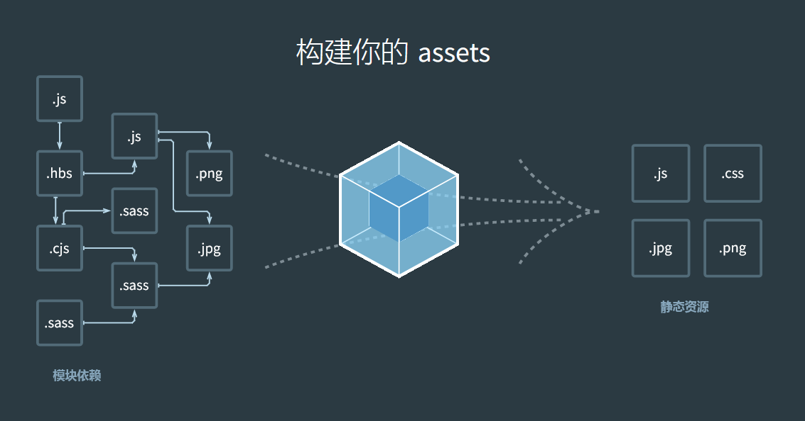

# Module  

JavaScript 模块化

## 1. 模块化

模块化是一种将 JavaScript 程序拆分，并可按需导入单独模块的一种机制。

> 模块系统主要解决模块的定义、依赖和导出。


## 2. 模块化的意义

```
1. 避免变量冲突和全局污染（每个文件，也就是模块，具有私有的命名空间）
2. 逻辑分离、按需加载，将不同的逻辑拆分放在不同的文件下，同一类逻辑可由一个文件管理
3. 代码复用性、可维护性、可读性
```

## 3. 模块化发展

```
0. 直接写在 <script> 标签里面
1. 基于对象、闭包的模块化 
2. Node.js 时代，CommonJS 规范
3. AMD 规范 (推崇依赖前置)
4. CMD 规范（改进的AMD，推崇就近原则，用到的时候再去加载）
5. ES6 Module 规范
```

### 1. 基于对象的模块化

在 CommonJS 规范出现之前，为了避免全局变量污染，常采用的一种方案就是将一类变量放在一个对象里面，作为对象的属性，使得这些变量私有化

```javascript
let Util = {
    toString: (str) {
        // ...
    },
    formatStr: (str)  {
        // ...
    }
}
let Math = {
    add: (a, b) {
        // return a + b 
    },
    max: () {
        // return max value
    }
}
```

#### 不足之处

```
1. 声明变量就变成了声明对象的一个属性，在对象外面可能会意外覆盖掉同名属性
2. 对象之间可能会覆盖的情况
3. 代码还是在一个文件里面，无法分而自治；随着功能添加，一个文件中的代码量也会越来越大
```

### 2. 基于闭包的模块化

**IIFE**(立即调用函数表达式)是 CommonJS 规范出来之前最典型的模块化方式，大名鼎鼎的 `jQuery` 就是使用的这种模块化方式

```javascript
// IIFE 是一个定义时就会调用的函数，定义一个 IIFE 也很简单
// IIFE 最后一定要加一个分号，表示结束
(function(arg) {
    console.log(arg) // window 对象
    const $ = jQuery = {}
    jQuery.add = (x, y) => {
        //....
    }
})(window);

(function(arg){
    console.log(arg)
    const $ = jQuery = {}
    jQuery.add = (x, y) => {
        // ...
    }
}(window));

// jquery 包装基本结构
(function(global, factor) {
    // ...
})(window, function(window, noGlobal) {
    // ...
});
```

#### 不足之处

```
1. IIFE 中的变量和函数不可复用
2. 使用不会很方便
3. 难以测试和维护
```

### CommonJS -- Node.js 的模块化

> CommonJS 的出现是为了服务于服务器端的。

> CommonJS 是一个项目，其目标是为 JavaScript 在网页浏览器之外创建模块约定。创建这个项目的主要原因是当时缺乏普遍可接受形式的 JavaScript 脚本模块单元，模块在与运行JavaScript 脚本的常规网页浏览器所提供的不同的环境下可以重复使用。

Node.js 的出现，将 JavaScript 语言带到了服务端，面对文件系统、网络、操作系统等复杂业务场景，模块化不可或缺。 